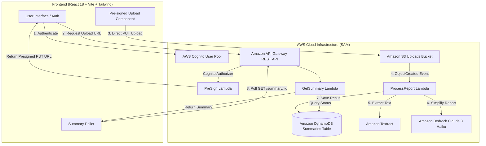

# 🏥 MedClear: AI Medical Report Simplifier

> **Empowering patients and elderly individuals to understand complex medical reports in plain, reassuring language.**

---

## 📌 Problem & Motivation

Medical lab reports and diagnostic summaries are filled with dense clinical jargon, confusing abbreviations, and complex reference ranges. For elderly individuals and patients without a medical background, receiving these reports often leads to anxiety, confusion, and difficulty knowing what questions to ask their doctor.

**MedClear** bridges this gap. By combining modern serverless cloud architecture with computer vision and generative AI, MedClear transforms complex medical documents into an accessible, 3-point plain-English breakdown within seconds.

---

## ✨ Key Features

- **📄 Universal Report Ingestion**: Upload PDF documents or smartphone camera photos (JPG, PNG) up to 10 MB.
- **👁️ AWS Textract OCR**: High-accuracy text extraction from medical records and lab panels.
- **🤖 Claude 3 Haiku on AWS Bedrock**: Intelligent medical summarization adhering strictly to empathetic, plain-language patient explanations using the Anthropic Messages API.
- **🎯 3-Point Actionable Breakdown**:
  1. **Plain-Language Summary**: A clear 3-sentence summary of the report's purpose and findings.
  2. **Flagged Findings**: Highlighted abnormal or out-of-range values in simple everyday terminology.
  3. **Doctor Questions**: 3 practical questions tailored for the patient to ask at their next doctor visit.
- **👵 Elderly-Friendly UI/UX**:
  - High-contrast, calming teal and slate design palette.
  - Large readable typography (minimum 16px body, clear headings).
  - Generous touch targets (minimum 48px buttons and inputs).
  - Fluid, reassuring motion cues powered by Framer Motion and an animated SVG document scanner.
- **🔒 Enterprise Security**:
  - AWS Cognito User Pool with JWT token verification.
  - Direct-to-S3 secure uploads via pre-signed URLs (no raw medical documents pass through the API).
  - IAM least-privilege roles and encrypted DynamoDB storage.

---

## 🏛️ System Architecture



---

## 💻 Tech Stack

### Frontend
- **Framework**: React 18 (Vite)
- **Styling**: Tailwind CSS with custom healthcare palette
- **Animations**: Framer Motion (page transitions, drag-and-drop feedback, staggered result cards)
- **Authentication**: AWS Amplify Auth
- **Icons**: Lucide React

### Backend (Serverless Application Model - SAM)
- **Runtime**: Python 3.14 on AWS Lambda
- **Authentication**: Amazon Cognito (User Pool & Identity Pool)
- **Storage**: Amazon S3 (Encrypted direct-to-S3 pre-signed uploads)
- **Database**: Amazon DynamoDB (Single-table design with PAY_PER_REQUEST billing)
- **Document OCR**: Amazon Textract (`DetectDocumentText`)
- **Generative AI**: Amazon Bedrock (`anthropic.claude-3-haiku-20240307-v1:0` via Anthropic Messages API)
- **API**: Amazon API Gateway with Cognito User Pool Authorizer

---

## 📁 Repository Structure

```
medclear-hackathon/
├── backend/
│   ├── src/
│   │   ├── presign/           # Lambda: Generates presigned S3 PUT URLs
│   │   │   ├── app.py
│   │   │   └── requirements.txt
│   │   ├── processReport/     # Lambda: S3 trigger -> Textract -> Bedrock -> DynamoDB
│   │   │   ├── app.py
│   │   │   └── requirements.txt
│   │   └── getsummary/        # Lambda: Polling endpoint for report status & summary
│   │       ├── app.py
│   │       └── requirements.txt
│   ├── template.yaml          # AWS SAM Infrastructure as Code (IaC)
│   ├── samconfig.toml         # SAM deployment defaults
│   ├── build.ps1              # UTF-8 automated build script
│   └── deploy.ps1             # Guided deployment script
├── frontend/
│   ├── src/
│   │   ├── components/
│   │   │   ├── AnimatedWrapper.jsx  # Framer motion page transitions
│   │   │   ├── Auth.jsx             # Accessible login & signup tabs
│   │   │   ├── UploadForm.jsx       # Drag-and-drop with scanning animation
│   │   │   └── Summary.jsx          # Staggered summary & questions display
│   │   ├── services/
│   │   │   ├── api.js               # API client (presign, upload, polling)
│   │   │   └── aws-config.js        # AWS Amplify configuration
│   │   ├── App.jsx                  # Main view controller
│   │   ├── index.css                # Tailwind directives & glassmorphism utilities
│   │   └── main.jsx
│   ├── index.html
│   ├── package.json
│   ├── tailwind.config.js
│   ├── vite.config.js
│   └── .env.example
├── .gitignore
└── README.md
```

---

## 🚀 Quick Start Guide

### Prerequisites
- Node.js 18+ and npm
- Python 3.11+ (Python 3.14 fully supported)
- AWS CLI & AWS SAM CLI
- AWS Account with Amazon Bedrock Claude 3 model access enabled

---

### Step 1: Run Frontend Locally

```bash
cd frontend
npm install
npm run dev
```

Open [http://localhost:5173](http://localhost:5173) in your browser.

---

### Step 2: Build & Deploy Backend (AWS SAM)

From the `backend/` directory:

```powershell
# In PowerShell:
.\build.ps1
.\deploy.ps1
```

Or using the standard SAM CLI:

```bash
sam build
sam deploy --guided
```

Once deployment completes, note the outputs:
- `ApiEndpoint`
- `UserPoolId`
- `UserPoolClientId`

---

### Step 3: Connect Frontend to Backend

A `.env.local` file has been configured in `frontend/` with the deployed AWS resources:

```env
VITE_AWS_REGION=us-east-1
VITE_USER_POOL_ID=us-east-1_JS9YLC01C
VITE_USER_POOL_CLIENT_ID=4r3kfn8juptkd0f5ipo85b3ptd
VITE_API_ENDPOINT=https://228givtfq2.execute-api.us-east-1.amazonaws.com/prod
VITE_IDENTITY_POOL_ID=us-east-1:8bfd8eb9-c384-465a-84e4-e9deef33d195
VITE_UPLOAD_BUCKET=medclear-prod-uploads-471932413325
```

Restart the frontend server:
```bash
npm run dev
```

---

## 🔒 Security & Privacy

- **No Medical Data Retention in Transit**: Files stream directly from the user's browser to an encrypted private S3 bucket using short-lived pre-signed URLs.
- **Least Privilege Access**: Each Lambda function is granted only the exact IAM permissions required for its role.
- **Patient Privacy**: All reports are associated with authenticated user sessions.

---

## ⚠️ Disclaimer

*MedClear is an AI-powered assistant designed solely for informational and educational purposes. It does not provide medical diagnoses, treatment recommendations, or professional healthcare advice. Always consult a qualified healthcare provider regarding medical conditions or test interpretations.*

